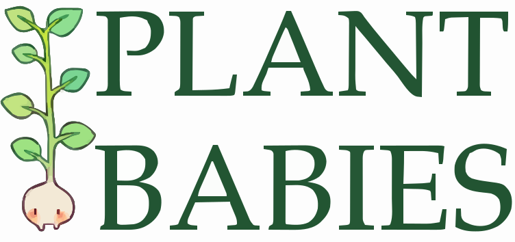
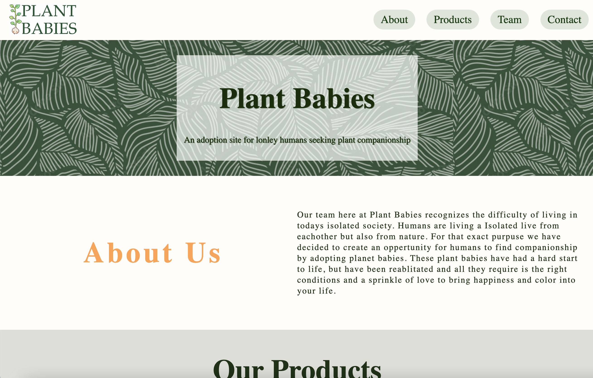
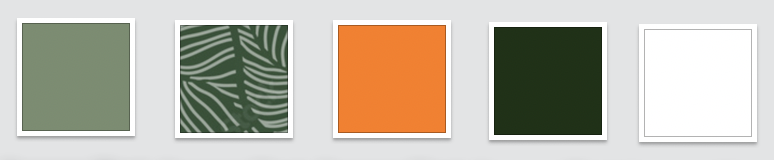

# Plant Babies

 

Welcome to Plant Babies, a site coded in HTML & CSS. See a **[live version](https://ornate-madeleine-8cd07d.netlify.app/)**. 

This project was part of my Codecadmy: Front-End Engineer path, aiming to strength my responsive design skills.  

## Insporation 

My site was inspired by my personal garden. I chose to design it with natural colors that showcase the beauty and legacy of plants.

To do so, I chose greens and whites as my color pallet, as well as a spalsh of orange as an accent color. 

In Additon, I used an old fashion looking font and images to capture the rustic but royal feeling plants can bring fourth. 

## Goals

The goal of my site was to practice website folder sturcture, deployment, design and most importantly responsive design. 

## Technologies

 
